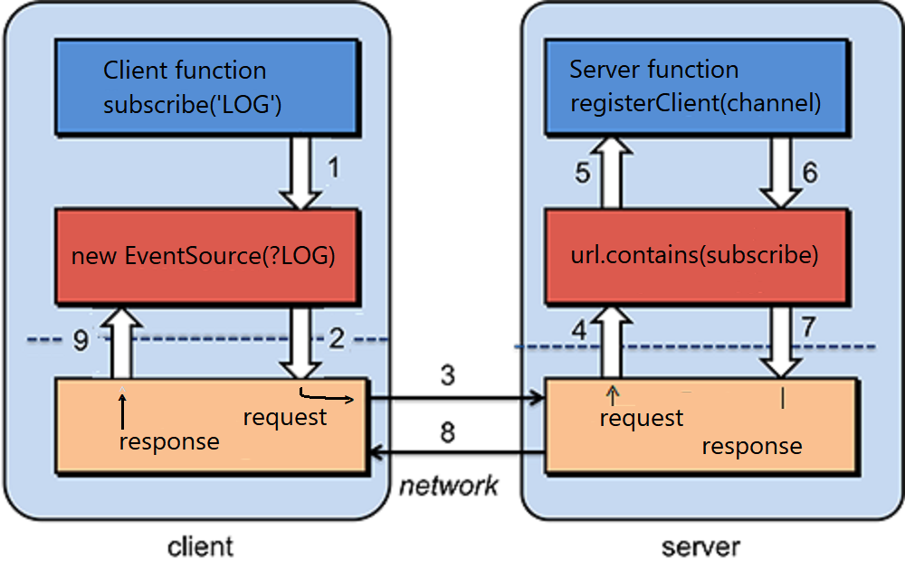
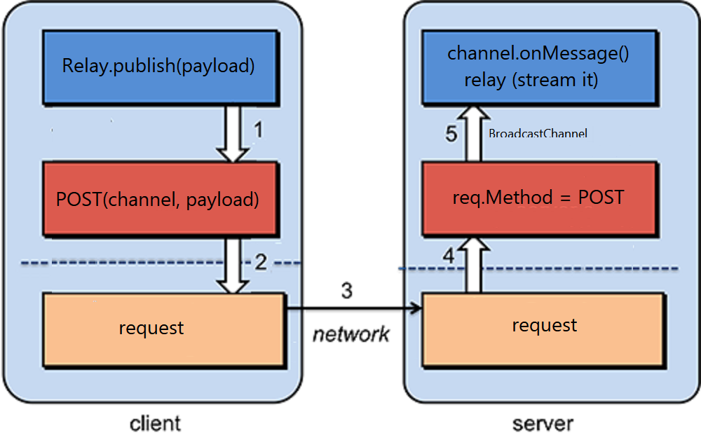
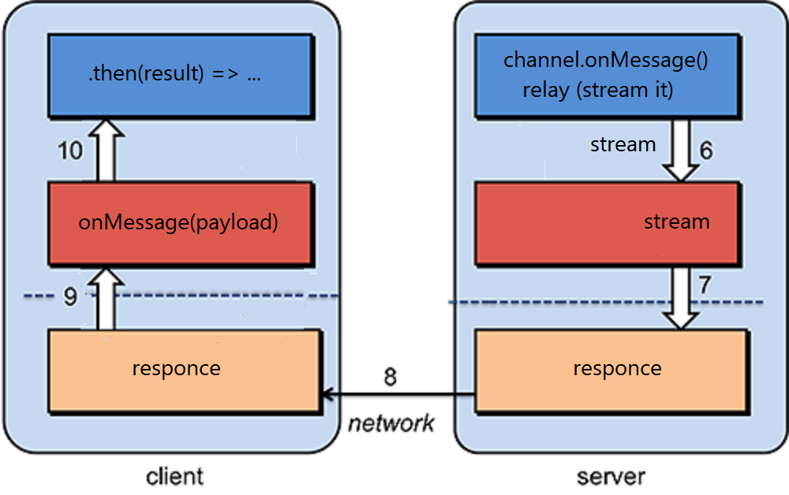

# Relay
## A simple Deno Pub/Sub service   
 

Relay is an asynchronous peer-to-peer communication microservice.    

On Deno Deploy, Relay can create a world-wide real-time data sharing bus.   
Relay can distribute any json-payload, including; app-events, database-updates, or analytics-events.  

Relay is stateless, and requires zero configuration.  Any massage payload that can be json-stringified, can be published to Relay.
   
In this pub/sub model, any message `published` to a channel is immediately   
received by all `subscribers` to that channel.

  - Watches Port 9099 for subscriptions or published messages (POST requests).
  - Streams all published messages to all subscribers using Server Sent Events.
  - Leverages Deno-BroadcastChannel to bridge deploy isolates and regions.

# Subscribe (server sent events registration)
To subscribe to Relay messages, we instantiate a new EventSource with a channel name   
as follows:
```ts 
// port 9099 is just a convention I use for Relay
const relayURL = `https://localhost:9099/subscribe/?channel="LOG"`;
const relayStream = new EventSource(relayURL);
```   

This will register this client for a stream of messages for the `LOG` channel.

<br/>



# Publish

To publish a message payload to a channel, we simply use fetch to   
'POST' a message to the service (localhost:9099):
```ts
export function publish(payload = '') {
   fetch(SERVICE_URL + "/", {
      method: "POST",
      body: JSON.stringify({
         channel: channelName,
         data: {
            TS: new Date().toLocaleTimeString('en-US'),
            from: "me",
            payload: payload
         }
      })
   });
}
```



## Then for each subscriber ...   

<br/>

